# 👋 MAYANK KOTULI

### 🎓 CSE • ABES ENGINEERING COLLEGE

**AI DEVELOPMENT • FULL-STACK • DSA IN C++ • CYBERSECURITY**

## 👨‍💻 ABOUT ME

**Computer Science & Engineering student at ABES Engineering College**, focused on building practical software and exploring **AI, full-stack development, DSA and cybersecurity**.

> **Build • Learn • Solve • Ship 🚀**

---

## ⚡ TECH STACK

<b>DSA & C++</b> • <b>Full-Stack Development</b> • <b>AI Development</b> • <b>Cybersecurity & Security Analysis</b>

---

## 📊 GITHUB ANALYTICS

## 🔥 CONTRIBUTION STREAK

## 📈 CONTRIBUTION ACTIVITY

## 🏆 GITHUB TROPHIES

---

## 🚀 FEATURED PROJECTS

### 🤖 FormMitra AI
**AI-powered voice-assisted form filling platform**

`AI` `OCR` `Voice AI` `Automation` `Full Stack`

### 🎓 ABES Autonomy
**Academic resources platform for ABES students**

`React` `Web Development` `UI/UX`

### 🏙️ CivicPulse
**AI-powered infrastructure inspection & predictive maintenance**

`AI` `Computer Vision` `Drones` `Predictive Analytics`

---

## 🤝 CONNECT WITH ME

### ⚡ CODE • LEARN • BUILD • REPEAT

**Thanks for visiting my profile! ⭐**

