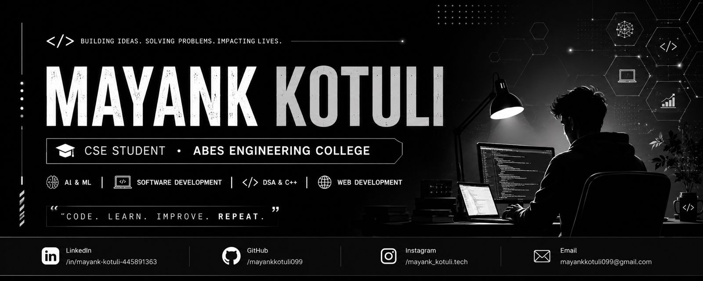

<h1 align="center">Hey 👋, I'm Mayank Kotuli</h1>

  <b>Computer Science & Engineering • ABES Engineering College</b>

  <i>Building ideas • Solving problems • Learning continuously • Shipping projects</i>

  
  
  

  

⸻

👨‍💻 About Me

I’m a Computer Science & Engineering student at ABES Engineering College who enjoys building real-world applications and exploring different areas of technology.

My interests span across software development, artificial intelligence, cybersecurity, problem solving and modern web technologies.

* 🎓 B.Tech — Computer Science & Engineering
* 🏫 ABES Engineering College
* 💻 Passionate about Software & Full-Stack Development
* 🧠 Practicing Data Structures & Algorithms in C++
* 🤖 Exploring Artificial Intelligence & AI Development
* 🔐 Interested in Cybersecurity & Security Analysis
* 🌐 Building modern and scalable Web Applications
* 🚀 Turning ideas into practical projects
* 📚 Always learning, experimenting and improving

⸻

⚡ What I Work With

 

 

⸻

🧠 Areas of Interest

Area	Focus
💻 DSA & C++	Problem solving, algorithms & competitive programming
🌐 Full-Stack Development	Modern frontend, backend & APIs
🤖 AI Development	AI-powered applications, automation & intelligent systems
🔐 Cybersecurity	Security, ethical hacking & security analysis
📱 Application Development	Cross-platform application development
🚀 Product Building	Turning ideas into usable real-world products

⸻

📊 GitHub Analytics

  
  

⸻

🔥 Contribution Streak

  

⸻

📈 Contribution Graph

  

⸻

🏆 GitHub Trophies

  

⸻

🚀 Featured Projects

🤖 FormMitra AI

AI-powered voice-assisted form filling platform

Upload a form → AI understands it → voice interaction collects information → the system helps generate a completed form.

Focus: AI • OCR • Voice AI • Automation • Full Stack

⸻

🎓 ABES Autonomy

Student-focused academic resources platform

A platform designed to make academic resources, notes, previous-year papers and study material easier for students to access and organize.

Focus: React • Web Development • UI/UX • Education Technology

⸻

🏙️ CivicPulse

AI-powered infrastructure inspection & predictive maintenance

An intelligent infrastructure monitoring concept combining AI-powered inspection, drone-based visual analysis and predictive maintenance to help identify civic infrastructure problems.

Focus: AI • Computer Vision • Drones • Infrastructure • Predictive Analytics

⸻

🛠️ Development Philosophy

        IDEA
         │
         ▼
     RESEARCH
         │
         ▼
      BUILD
         │
         ▼
       TEST
         │
         ▼
      IMPROVE
         │
         ▼
       SHIP 🚀

⸻

📚 Currently Exploring

C++ & DSA • Full-Stack Development • AI Development

Cybersecurity • Computer Vision • Backend Development

⸻

🎯 My Goals

* Build meaningful real-world software
* Strengthen problem-solving and DSA skills
* Develop production-ready full-stack applications
* Explore advanced AI systems
* Improve cybersecurity knowledge
* Contribute to open-source projects
* Keep learning and building consistently

⸻

📌 GitHub Activity

  

⸻

🤝 Let’s Connect

⸻

  <b>⚡ Code • Learn • Build • Repeat</b>

  ⭐ Thanks for visiting my profile!

